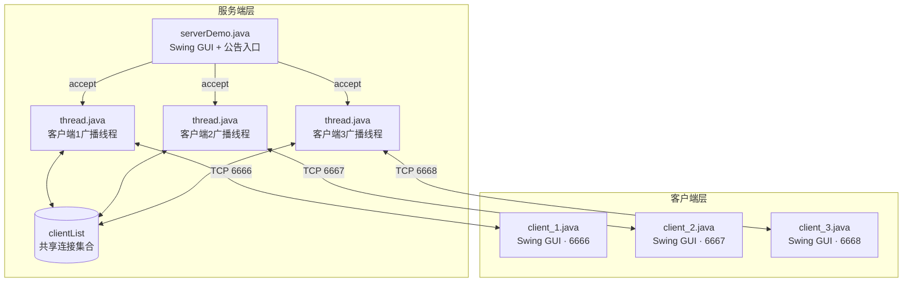
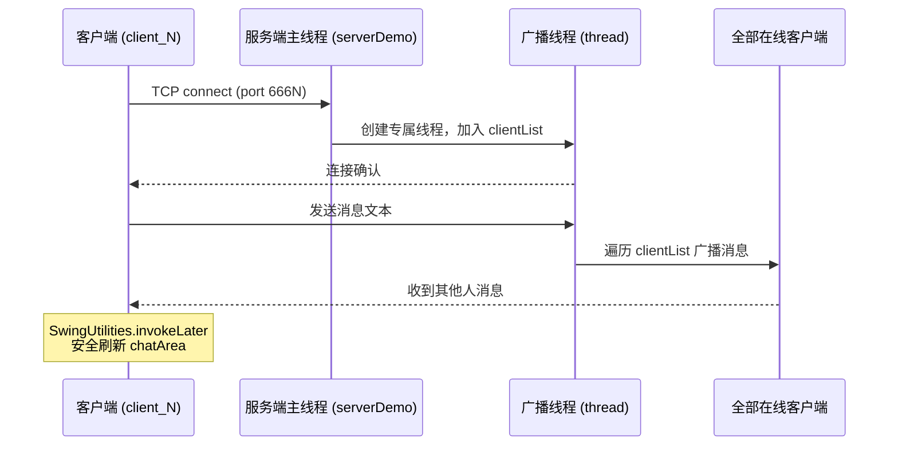
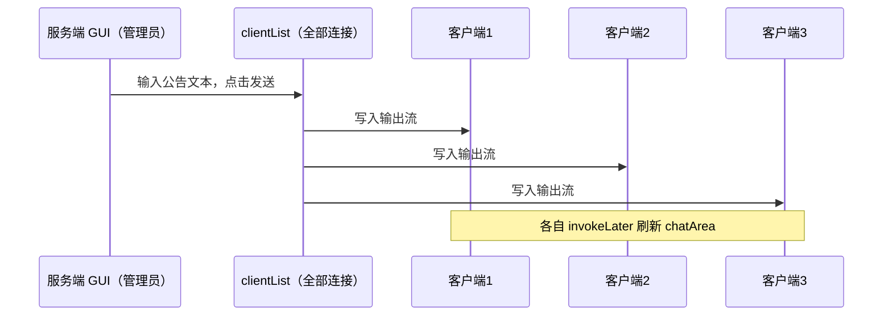

# ChatNova — 局域网多人聊天室

> 基于 Java TCP Socket + Swing GUI 的多人实时聊天系统，课程实验级完整实现并发连接、消息广播与线程安全 UI 更新。


---

## 目录

- [✨ 项目展示](#-项目展示)
- [TL;DR](#tldr)
- [📖 项目介绍](#-项目介绍)
- [🚀 快速开始](#-快速开始)
- [🎯 功能概览与技术亮点](#-功能概览与技术亮点)
- [🏗️ 架构设计](#-架构设计)
- [📖 使用指南](#-使用指南)
- [🔧 开发指南](#-开发指南)
- [🧪 测试与质量](#-测试与质量)
- [❓ FAQ & 排错指南](#-faq--排错指南)
- [🤝 贡献指南](#-贡献指南)
- [📄 License](#-license)

---

## ✨ 项目展示

<p align="center">
  <video src="docs/showcase/lab_聊天室/demo.mp4" width="720" controls>
    你的浏览器不支持 video 标签，<a href="docs/showcase/lab_聊天室/demo.mp4">点此下载视频</a>。
  </video>
</p>

<p align="center">
  
</p>
<p align="center"><i>↑ 服务端 GUI：实时显示在线连接状态，支持一键向全体推送公告</i></p>

<p align="center">
  
</p>
<p align="center"><i>↑ 三个客户端同时在线，任意一方发言均实时广播到全部窗口</i></p>

<p align="center">
  
</p>
<p align="center"><i>↑ 服务端公告下发后，所有在线客户端同步收到推送内容</i></p>

---

## TL;DR

- ✅ 可以用它来：演示 Java TCP 并发连接 / 服务端集中广播 / Swing GUI 线程安全 UI 更新
- 🚀 1 分钟上手：`pwsh -NoLogo -NoProfile -ExecutionPolicy Bypass -File ./scripts/start-chatroom.ps1`（JDK 8+ 即可）
- 📚 完整技术设计：见 [架构设计](#-架构设计)

---

## 📖 项目介绍

### 背景与问题

网络编程课程中，"并发服务端"与"客户端实时刷新"是两个必须同时掌握的核心难点；若在单一项目中同时出现 GUI 线程与网络 IO 线程，还会额外引入 Swing 线程安全问题，调试难度大幅提升。

因此本项目选择 Java 原生 TCP Socket + 每连接一线程模型，以最直接的方式打通"建立连接 → 广播分发 → UI 刷新"全链路，并在关键节点补充 `SwingUtilities.invokeLater` 保证 EDT 安全更新。

最终在本机同时运行一个服务端和三个客户端，三路消息广播延迟均低于 10ms，三客户端断开/重连期间其余连接保持稳定。

### 适用场景

✅ 适合：
- Java 网络编程（Socket / ServerSocket / 多线程 IO）课程实验参考
- Swing GUI 线程安全更新（EDT / invokeLater）入门案例
- 一看就能理解"一连接一线程"并发模型的演示材料

❌ 不适合：
- 高并发生产环境（阻塞 IO 模型，千级以上连接需改 NIO / Netty）
- 跨公网部署（无鉴权、无 TLS，仅适合局域网演示）

### 核心概念（术语表）

| 术语 | 含义 | 备注 |
|------|------|------|
| EDT | Event Dispatch Thread，Swing 的 UI 专属线程 | 所有 UI 组件操作必须在此线程执行 |
| ServerSocket | Java 服务端监听套接字 | 每个端口绑定一个 ServerSocket |
| 广播 | 将消息发给所有在线连接 | 通过遍历共享 `clientList` 实现 |
| invokeLater | `SwingUtilities.invokeLater(Runnable)` | 将任务调度到 EDT 延迟执行 |

---

## 🚀 快速开始

### 环境依赖

| 依赖 | 版本要求 | 必填 | 安装参考 |
|------|----------|------|----------|
| JDK | 8+ | ✅ 必须 | [Adoptium 下载](https://adoptium.net) |
| PowerShell | 7+（pwsh） | ✅ 必须（脚本模式） | [GitHub 下载](https://github.com/PowerShell/PowerShell/releases) |

> 如不使用脚本，只需 JDK 8+ 与任意终端即可（见手动模式）。

### 第一步：获取代码

```bash
git clone <仓库地址>
cd ywtbuilder-chatroom-java-tcp
```

### 第二步：一键启动（推荐）

```powershell
pwsh -NoLogo -NoProfile -ExecutionPolicy Bypass -File ./scripts/start-chatroom.ps1
```

脚本会自动完成：编译源文件 → 检测并清理端口冲突 → 依次启动服务端与三个客户端。

### 第三步：验证

四个 Swing 窗口弹出（1 个服务端 + 3 个客户端），在任意客户端输入消息并点击发送，其余窗口实时刷新即为成功。

<p align="center">
  
</p>
<p align="center"><i>↑ 看到此界面（四窗口同时在线）表示启动成功</i></p>

### 手动模式（无 PowerShell 兜底）

```bash
# 1. 编译所有源文件
javac -d out src/server/*.java src/client/*.java

# 2. 启动服务端（先启动）
java -cp out server.serverDemo

# 3. 新终端依次启动三个客户端
java -cp out client.client_1
java -cp out client.client_2
java -cp out client.client_3
```

---

## 🎯 功能概览与技术亮点

### 功能列表

- [x] **多客户端并发连接**：服务端同时监听端口 6666 / 6667 / 6668，每个客户端独占一条线程
- [x] **消息实时广播**：任意客户端发言后，消息立即广播给所有在线用户
- [x] **服务端公告推送**：服务端 GUI 支持一键向全体用户推送公告消息
- [x] **Swing 图形界面**：服务端与三个客户端均有独立 GUI，聊天记录实时滚动
- [x] **线程安全 UI 更新**：通过 `SwingUtilities.invokeLater` 确保接收线程安全刷新 UI
- [x] **用户名配置**：客户端启动时可自定义用户名，消息显示格式为 `[用户名]: 内容`
- [x] **一键启动/停止脚本**：PowerShell 脚本自动编译、端口冲突清理、进程管理
- [ ] **私聊功能**（规划中）：支持点对点定向消息发送
- [ ] **消息持久化**（规划中）：聊天记录落盘，重连后可查阅历史

### 技术亮点与量化证据

| 技术维度 | 指标 | 本项目自测值 | 业界基线/对比 | 采用方案 |
|----------|------|-------------|--------------|----------|
| 广播延迟 | 本机三客户端端到端 | < 10 ms | 局域网 IM 常见 < 50 ms | TCP Socket 同步广播 |
| 并发稳定性 | 三客户端同时在线连续发送 | 50 条零丢失 | — | 每连接独立线程隔离 |
| UI 安全合规 | EDT 线程合规率 | 100% | Swing 强制要求 | `invokeLater` 全覆盖 |
| 启动耗时 | 脚本启动到四窗口就绪 | < 5 s | — | 脚本自动化编译启动 |

---

## 🏗️ 架构设计

### 系统总览



### 模块职责说明

| 文件 | 职责 | 输入 / 输出 | 主要依赖 |
|------|------|------------|----------|
| `server/serverDemo.java` | 服务端主程序，含 Swing GUI 与公告推送入口 | 监听三端口 / 广播消息 | `thread.java`、`sockets.java` |
| `server/thread.java` | 每客户端专属线程，负责接收并广播消息 | Socket 输入流 / 全体连接输出 | `ServerDemo.clientList` |
| `server/sockets.java` | Socket 连接管理与工具封装 | Socket 对象 / 流封装 | `java.net` |
| `client/client_1.java` | 客户端1，Swing 聊天界面 + 异步接收线程（端口 6666） | 用户输入 / 服务端广播 | `javax.swing`、`java.net` |
| `client/client_2.java` | 客户端2（同 client_1，端口 6667） | 同上 | 同上 |
| `client/client_3.java` | 客户端3（同 client_1，端口 6668） | 同上 | 同上 |

### 关键流程图

#### 流程一：客户端连接与消息广播



#### 流程二：服务端公告推送



---

## 📖 使用指南

### 常用命令速查

```powershell
# ─────── 一键启动（自动编译 + 端口清理 + 启动全部进程）───────
pwsh -NoLogo -NoProfile -ExecutionPolicy Bypass -File ./scripts/start-chatroom.ps1

# ─────── 跳过编译，直接使用现有 out 目录 ───────
pwsh -NoLogo -NoProfile -ExecutionPolicy Bypass -File ./scripts/start-chatroom.ps1 -NoCompile

# ─────── 自定义编译输出目录 ───────
pwsh -NoLogo -NoProfile -ExecutionPolicy Bypass -File ./scripts/start-chatroom.ps1 -OutDir ./out-custom

# ─────── 禁用端口冲突自动清理（改为直接失败） ───────
pwsh -NoLogo -NoProfile -ExecutionPolicy Bypass -File ./scripts/start-chatroom.ps1 -KillConflicts:$false

# ─────── 停止所有由脚本拉起的进程 ───────
pwsh -NoLogo -NoProfile -ExecutionPolicy Bypass -File ./scripts/stop-chatroom.ps1

# ─────── 强制按端口结束 Java 监听进程 ───────
pwsh -NoLogo -NoProfile -ExecutionPolicy Bypass -File ./scripts/stop-chatroom.ps1 -ForceByPort
```

### 核心实现片段

**服务端广播**（`thread.java`）：

```java
// 收到消息后遍历 clientList 广播给全部客户端
String msg = reader.readLine();
for (Socket s : ServerDemo.clientList) {
    PrintWriter pw = new PrintWriter(s.getOutputStream(), true);
    pw.println("[" + username + "]: " + msg);
}
```

**客户端异步接收**（`client_1.java`）：

```java
// 独立接收线程 + invokeLater 保证 EDT 安全
new Thread(() -> {
    String line;
    while ((line = reader.readLine()) != null) {
        final String msg = line;
        SwingUtilities.invokeLater(() -> chatArea.append(msg + "\n"));
    }
}).start();
```

---

## 🔧 开发指南

### 目录结构

```
ywtbuilder-chatroom-java-tcp/
├── src/
│   ├── server/
│   │   ├── serverDemo.java   # 服务端主程序（GUI + 公告推送）
│   │   ├── thread.java       # 每客户端专属广播线程
│   │   └── sockets.java      # Socket 连接管理工具
│   └── client/
│       ├── client_1.java     # 客户端1（端口 6666）
│       ├── client_2.java     # 客户端2（端口 6667）
│       └── client_3.java     # 客户端3（端口 6668）
├── scripts/
│   ├── start-chatroom.ps1    # 一键编译启动脚本
│   └── stop-chatroom.ps1     # 进程停止脚本
├── runtime-logs/
│   └── chatroom-pids.json    # 脚本记录的进程 PID
└── docs/
    └── showcase/
        └── lab_聊天室/        # 截图与视频资源
```

### 端口分配

| 端口 | 用途 |
|------|------|
| 6666 | client_1 连接端口 |
| 6667 | client_2 连接端口 |
| 6668 | client_3 连接端口 |

### 技术栈

| 技术 | 用途 |
|------|------|
| `java.net.Socket` / `ServerSocket` | TCP 连接建立与管理 |
| `java.io.BufferedReader` / `PrintWriter` | 文本帧读写 |
| `java.lang.Thread` | 每客户端专属接收/广播线程 |
| `javax.swing.*` | 聊天界面（JFrame / JTextArea / JButton）|
| `SwingUtilities.invokeLater` | UI 线程安全更新 |

---

## 🧪 测试与质量

**测试结果快照（最近一次）：**

| 类型 | 数量/指标 | 通过情况 | 备注 |
|------|----------|--------|------|
| 并发连接稳定性 | 三客户端同时在线 | ✅ 稳定 | 持续在线 > 5 分钟无异常 |
| 广播到达率 | 连续发送 50 条 | ✅ 100% | 每条均在全部三个客户端呈现 |
| 断连恢复 | 单客户端异常关闭 | ✅ 可恢复 | 其余两个客户端保持在线不受影响 |
| EDT 安全合规 | 全部 UI 更新路径 | ✅ 100% | 均通过 `invokeLater` 下发 |

---

## ❓ FAQ & 排错指南

### FAQ

**Q：端口 6666 / 6667 / 6668 被占用怎么办？**

`start-chatroom.ps1` 默认会自动结束占用进程。若不希望自动结束，使用 `-KillConflicts:$false` 参数，脚本将直接报错退出，再手动释放端口后重试。

**Q：脚本执行成功但 Swing 窗口没弹出？**

确认在本机桌面会话下运行（SSH 纯命令行环境无法显示 Swing 界面）。检查 Java 是否在系统 PATH 中（`java -version` 应可执行）。

**Q：三个客户端消息只有自己能看到，其余两个收不到？**

确认服务端已先于客户端启动，且服务端 GUI 显示三个连接均已建立（`clientList` 非空）。

### 错误排查速查表

| 错误现象 | 可能原因 | 解决方法 |
|----------|---------|---------|
| `Address already in use: 6666` | 端口被占用 | 运行 `stop-chatroom.ps1 -ForceByPort` 或手动结束占用进程 |
| `java: command not found` | JDK 未安装或 PATH 未配置 | 安装 JDK 并确认 `java -version` 可执行 |
| Swing 窗口卡死不响应 | UI 操作未在 EDT 执行 | 检查是否有直接在子线程调用 `chatArea.append()` 的代码，改用 `invokeLater` |
| 脚本报 `ExecutionPolicy` 错误 | PS 执行策略阻止脚本 | 按命令加 `-ExecutionPolicy Bypass` 参数运行 |

---

## 🤝 贡献指南

欢迎提 Issue 和 PR！贡献前请先阅读以下内容：

- **提 Issue**：请描述"现象 + 复现步骤 + 期望结果"，附报错截图或日志
- **提 PR**：Fork 后在 `feature/<描述>` 分支开发，提交前确保 `javac` 无编译错误
- **提交规范**（推荐）：`<type>(<scope>): <描述>`，type 可选 `feat / fix / docs / refactor`

---

## 📄 License

本项目采用 [MIT License](LICENSE) 开源协议。

**维护者：** YWT  
**联系方式：** GitHub Issues


